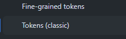

# Pasos para poder subir a git

### Primer paso es poder instalar los que es GIT 
Intalacion: https://git-scm.com/

Esto es la pagina oficial de git en el cual tienen que instalarlo para poder subir esto ya que esto sirve para poder hacer un control de versiones y poder  hacer algunas correcciones

#  Segundo paso

En estos casos ya instalado git para los que no tengan  nada tienen que hacer sus primer comando de git
en el cual consiste primero en crear una carpeta con nombre  de Proyecto 
y adentro de eso su primer comando va a ser

## git clone https://github.com/santiRui/proyecto-mazamorra.git

Con esto van a traer todas las carpetas para que puedan ver como se esta trabajando y que ya esta subido


# Tercer paso 
Para este paso en caso de evitar problemas van a tener que crear un token para sus repos
lo hacen en el mismo git y es asi:

https://github.com/settings/tokens

En este apartado van a ver que apare create token y 2 formas 



Tienen que poner la forma clasica (clasic)

Luego veran que aparece muchas listas para poder seleccionar ustedes eligen 
repo 
y luego 
workflow
seleccionas estas 2 y agregan un nombre cualquiera en NOTEE: 
Luego al final va a parecer generar token y bueno les va a generar un token medianamanete largo tienen que guardarlo es solo para ustedes y luego de eso actualizan la url que lo hacen de esta manera

## git remote set-url origin https://(Su token)@github.com/santiRui/proyecto-mazamorra.git
 y luego de esto hacen 

## Ahora les toca subir algun cambio o modificacion que se hace de esta manera


# Muestro los 3 comandos esenciales 

## git add .

## git commit -m "Descripción del cambio"

## git push origin main
```bash
git add README.md
git commit -m "Se agrega documentación sobre Git"
git push origin main
```
# Y con esto podan ver que ya esta todo para que puedan subir o modificar cosas 
Recomendaciones: 
Para los commit hagan una  buenas descripcion para que sepan porque se sube x cosas  o porque se cambian ciertas cosas 


